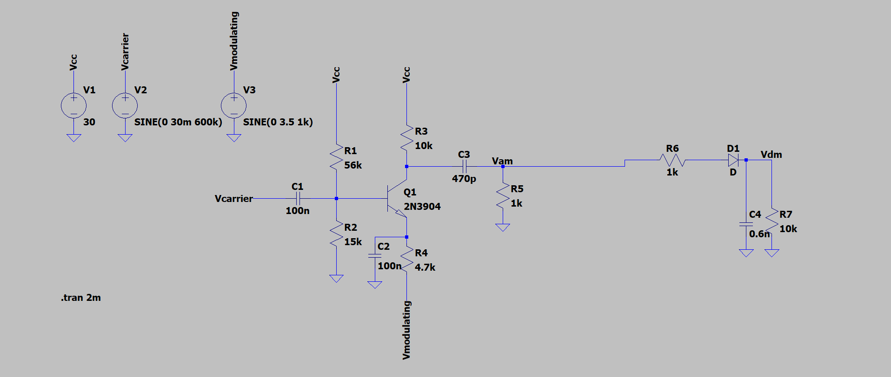
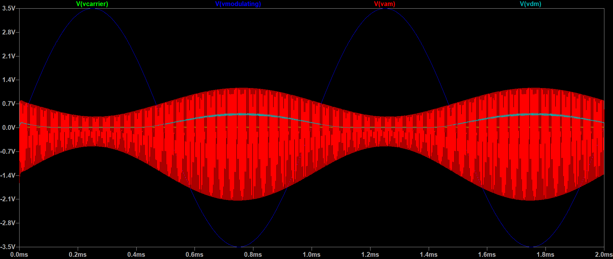

# AM Radio Communication System Simulation

This project simulates an AM (Amplitude Modulation) radio communication system using LTSpice. It includes both modulation and demodulation processes.

## Project Structure

- [`Graph.png`](LtSpice_Project/Graph.png): Graphical representation of the simulation results.
- [`Schematic.png`](LtSpice_Project/Graph.png): Schematic diagram of the AM radio communication system.
- [`Spice_Simulation.bjt.asc`](Lt_Spice_Project.bjt.asc): LTSpice simulation file for the AM radio communication system.

## Requirements

- LTSpice software

## Schematic Diagram

## Simulation Results

## Credits

Developed by [Ceres2805](https://github.com/Ceres2805)
